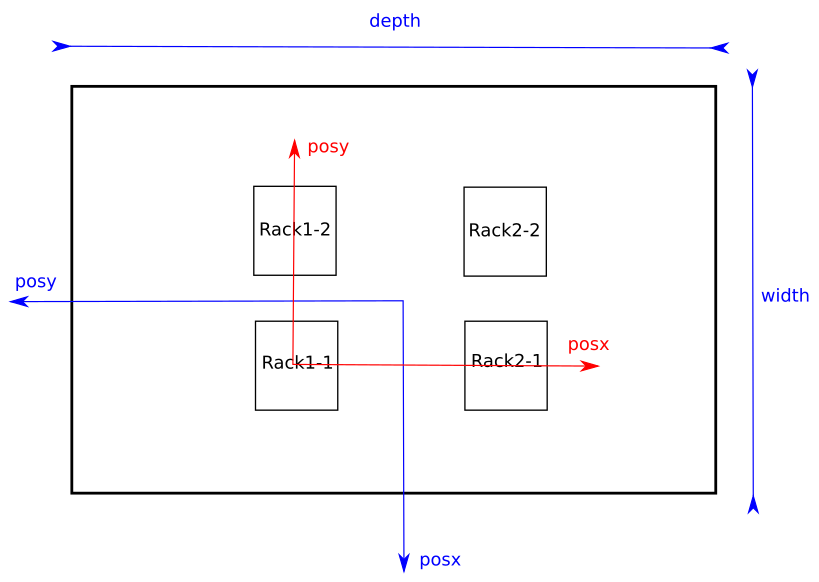

Installation Guide
==================

Download
--------

Source code
^^^^^^^^^^^

The source code of Slurm-web is hosted on GitHub at this URL:
https://github.com/edf-hpc/slurm-web

You can download latest version of this source code by clone the Git repository::

    git clone https://github.com/edf-hpc/slurm-web.git

Debian packages
^^^^^^^^^^^^^^^

We are currently thinking about providing pre-built Debian packages for
Slurm-web ready to download and install. For the moment, you will have to build
these packages by yourself from the source.

On a Debian based system with all build dependencies installed, run the
following command (or any similar) to build the binary packages::

    debuild -us -uc

The packages should build properly, then you can add them to your own internal
Debian repository.

Requirements
------------

For the moment, Slurm-web is developed as a native Debian package. This means it
is very easy to install it and configure it on Debian based GNU/Linux
distributions (eg. Ubuntu).

However, the drawback is that it becomes much harder to install it on others
RPM based GNU/Linux distributions (such as RHEL, Centos, Fedora, and so on).
If you want to improve the situation on these distributions, please contact us.

The backend API depends on the following libraries:

* `Flask`_ web framework,
* `PySLURM`_, the python binding to Slurm C libraries,
* `ClusterShell`_ , a distributed shell with nodeset manipulation Python library

.. _Flask: http://flask.pocoo.org/
.. _PySLURM: http://www.gingergeeks.co.uk/pyslurm/
.. _ClusterShell: http://cea-hpc.github.io/clustershell/

The dashboard has the following dependencies:

* `bootstrap`, the responsive HTML, JS and CSS framework,
* `jQuery`_ JS library,
* `Flot`_, a jQuery extension for drawing charts.

.. _bootstrap: http://getbootstrap.com/
.. _jQuery: https://jquery.com/
.. _Flot: http://www.flotcharts.org/

Installation
------------

From source
^^^^^^^^^^^

Not supported yet. Please contact us if you want to improve this part.

Distributions
^^^^^^^^^^^^^

Debian/Ubuntu
"""""""""""""

Once the binary packages of Slurm-web are in your internal Debian repository, simply
install these packages with the following command::

    apt-get install slurm-web-restapi slurm-web-dashboard

RHEL/Centos
"""""""""""

Not supported yet. Please contact us if you want to improve this part.

Configuration
-------------

The configuration of Slurm-web is composed of a few files, an XML description
of your racks and nodes, a file for the REST API configuration, and some files
for the dashboard configuration.
The content and format of these files is explained in the following
sub-sections.

XML racks and nodes description
^^^^^^^^^^^^^^^^^^^^^^^^^^^^^^^

Slurm does not provide sufficient information about the nodes and the racks
composing a supercomputer for representing it accurately with correct node sizes
and distribution over the racks. For this purpose, Slurm-web backend API relies
on an additional file located under the path ``/etc/slurm-web/racks.xml``.

This file must contain the complete description of your racks and nodes in XML
format. Here is an example of file:

.. code-block:: xml

    <?xml version="1.0" encoding="UTF-8"?>
    <!DOCTYPE rackmap SYSTEM "/usr/share/slurm-web/restapi/schema/dtd/racks.dtd">
    <rackmap>

      <nodetypes>
        <nodetype id="m32x4321" model="Vendor A 32 x4321" height="1" width="0.5" />
        <nodetype id="b43" model="Vendor B 43" height="2" width="1" />
      </nodetypes>

      <racks posx="0" posy="0" width="10" depth="10">
        <racksrow posx="0">
          <rack id="rack1-1" posy="0">
            <nodes>
              <node id="cn001" type="m32x4321" posx="0" posy="2" />
              <node id="cn002" type="m32x4321" posx="0.5" posy="2" />
              <node id="cn003" type="m32x4321" posx="0" posy="4" />

              <nodeset id="cn[004-072]" type="m32x4321" posy="5" />
            </nodes>
          </rack>

          <rack id="rack1-2" posy="1">
            <nodes>
              <node id="cn101" type="m32x4321" posx="0" posy="1" />
              <nodeset id="cn[102-121]" type="m32x4321" posy="5" />
            </nodes>
          </rack>
        </racksrow>

        <racksrow posx="1">
          <rack id="rack2-1" posy="0">
            <nodes>
              <node id="cn201" type="m32x4321" posx="0" posy="3" />
              <node id="cn202" type="m32x4321" posx="0.5" posy="3" />
              <node id="cn203" type="m32x4321" posx="0" posy="4" />

              <nodeset id="cn[204-272]" type="m32x4321" posy="6" />
            </nodes>
          </rack>

          <rack id="rack2-2" posy="1">
            <nodes>
              <node id="cn301" type="b43" posx="0" posy="0" />
              <nodeset id="cn[302-319]" type="b43" posy="5" />
            </nodes>
          </rack>
        </racksrow>
      </racks>
    </rackmap>

The root element of the XML file is ``<rackmap>``. This root element must contain
2 elements: ``<nodetypes>`` and ``<racks>``.

The ``<nodetypes>`` element contains the description of all types of nodes with
their models and sizes. Each type of node is described within a distinct
``<nodetype>`` element with a unique ID (ex: *m32x4321*). This ID will be later
used as a reference of type for nodes. Each node type must have a
``model`` attribute whose content is free text, a ``height`` and a ``width``
whose values must be floats in U unit. For example, a node with a width of 0.5
uses half of rack width. With a height of 2, a node will uses 2 U in rack height.

The organization of the different racks is designed by rows of racks, in order
to generate a 3D view of the room containing the racks composing the supercomputer.

The ``<racks>`` element contains the list of the rows of racks, corresponding to
the ``<racksrow>`` elements. It has these attributes:

- a ``posx`` attribute and  a ``posy`` attribute to set the position of the racks
  inside the room (the origin is corresponding to the center of the 3D view)
- a ``width`` attribute and  a ``depth`` attribute to set the size of the room
- and finally  a ``rackwidth`` attribute to set the width of a rack.

Each ``<racksrow>`` element has a ``posx`` attribute to define the position of
the corresponding row of racks, starting from the left of the screen, and
contains a list of racks, each one being described in a distinct ``<rack>``
element. Each attribute for either ``<racks>`` or ``<racksrow>`` or ``<rack>``
elements use the width of a rack as unit.

Each rack element must have a unique ID which will be then used as rack name. A
rack must have a position in its ``<racksrow>``, within ``posy`` attribute.
These attributes about position must be integer, they represent the rack
position within a grid with all racks. If ``posx`` and ``posy`` attributes are
skipped, then we assume they are equal to ``0``. Two racks should not have the
same positions.

See in the schema below the relation between the parameters and the
corresponding representation of the racks in the 3D view. Parameters for
``<racks>`` element are shown in blue, those for ``<racksrow>`` or ``<rack>``
elements in red.

A rack contains a set of nodes within ``<nodes>`` element as shown in
the previous example. As usual, ``posx`` and ``posy`` attributes are assumed
to be equal to ``0`` if missing. Besides, ``<nodeset>`` elements can have
an attribute ``draw`` which will tell in which direction Slurm-Web
will draw the nodes in the rack (``up`` or ``down``). When missing, it is
set to ``up``.

Here is the rendering of the 2D view according to this example of
``racks.xml``:

.. image:: img/screenshot_racks-2D_rendering_example.*
   :width: 800px

Here is the rendering of the jobsmap view according to this example of
``racks.xml``:

.. image:: img/screenshot_jobsmap_rendering_example.*
   :width: 800px

Here is the rendering of the 3D view according to this example of
``racks.xml``:

.. image:: img/screenshot_racks-3D_rendering_example.*
   :width: 800px

Once you have completely described all the racks and nodes composing your
supercomputer, you can check the file format by validating it against the
provided DTD file with the following command::

    xmllint --valid --noout /etc/slurm-web/racks.xml

User running the REST API
^^^^^^^^^^^^^^^^^^^^^^^^^

By default, the user running the REST API is set to ``www-data`` in
``/etc/apache2/conf-available/slurm-web-restapi.conf``. If some
resources in your Slurm cluster are accessible to only some of your
users, then Slurm-Web won't show them. Using a user with enough
credentials will fix the problem. Usually, setting the user to ``slurm``
(see *slurm.conf*) is enough.

REST API configuration
^^^^^^^^^^^^^^^^^^^^^^

All the configuration of the REST API is handled in ``conf/restapi.conf``.
Here is an example of a valid configuration file:

.. code-block:: python

  # configure here all parameters for the Slurm-web REST API

  [cors]
  # give here the list of the domains from where the origin is authorized,
  # separated by commas
  #
  # example : authorized_origins = http://example1.com,http://example2.com
  authorized_origins = http://dashboard.myslurmhpc.com

  [config]
  secret_key = my_awesome_secret_key
  # Set to 'enable' to activate authentication.
  # Authentication is based on LDAP, so an LDAP server and the good configuration
  # for it, below in this file, are required.
  authentication = enable
  # Set to 'enable' to activate cache.
  cache = enable
  # Path for racks description (default to /etc/slurm-web/racks.xml).
  racksxml =

  [roles]
  # The `all` role can have 2 values:
  # - none, restrict access to authenticated users only
  # - all, free access to non-sensible data
  all = all
  # The roles members can be defined with a list of groups (whose names
  # are prefixed by @) and logins.
  user = @usergroup,user
  admin = @admingroup,adminuser

  # Give here restricted fields about jobs for each role, separated by commas
  restricted_fields_for_all = command,account
  restricted_fields_for_user = command
  restricted_fields_for_admin =

  [acl]
  # You can set here an access control list for each view of the dashboard for
  # this cluster.
  # This feature requires authentication to be enabled.
  # For each view, you can give a list of groups (whose names are prefixed by @)
  # and logins, to define who can access to this view.
  # If no ACL is provided for a view, so every authenticated user can access to
  # this view.
  # i.e. ``jobs = @admin,pierre`` implies that the jobs view will be available
  # only for every user from the group 'admin', and the user with 'pierre' as
  # login.
  # If you give an empty value for an entry (i.e. ``jobs =``), the corresponding
  # view will not be accessible for anybody.
  #
  # Available views are : [
  #   'jobs', 'jobsmap', 'partitions', 'reservations', 'qos', 'racks', '3dview',
  #   'gantt', 'topology'
  # ]
  jobs = @users,@admin
  gantt = @admin,pierre
  3dview =

  [ldap]
  # Configure here settings to connect to your LDAP server.
  uri = ldap://admin:389
  base = dc=cluster,dc=local
  ugroup = people
  expiration = 1296000

  [racks]
  # path for racks description (default to /etc/slurm-web/racks.xml)
  path = /etc/slurm-web/racks.xml

  [cache]
  # address for Redis server (default to host=localhost, port=6379)
  redis_host = localhost
  redis_port = 6379
  # TTL for jobs (default to 10 seconds)
  jobs_expiration = 10
  # TTL for other informations (default to 86400 seconds = 24 hours)
  global_expiration = 86400

CORS
""""

To allow a Slurm-web dashboard to retrieve informations from a Slurm cluster on
a different server than the one where the dashboard is, you can configure the
domain where your dashboard is hosted. The REST API is even able to be polled
from several crossdomain dashboards: just set origins of each dashboard in the
``authorized_origins`` parameter, separated by commas.

Authentication
""""""""""""""

The REST API has an authentication mechanism, based on an LDAP server. If the
parameter ``authentication`` is set to ``enable``, the dashboard will ask to the
user his credentials. This feature requires the configuration of the LDAP server
in the ``[ldap]`` section.

When enabled, the authentication feature handles different roles for the users:

* "all": the role for unauthenticated users. When the parameter ``all`` is set
  to ``none``, users have to be authenticated to access the datas from the
  REST API on a Slurm-web dashboard. When it is set to ``all``, users can access
  datas as guests: a "Guest" button is then added on the login page of the
  dashboard for this REST API.

* "user": this role is for authenticated users. The parameter ``user`` accepts a
  list of values to define authorized users either by the group he belongs to,
  or by their login.

* "admin": this role is for administrators. The parameter ``admin`` works as the
  ``user`` one.

For each role, a corresponding "restricted field" parameter exists to set some
fields about jobs which have to be hidden to the defined users. Just set a list
of the field's name separated by commas.

Cache
"""""

The cache mechanism is used to prevent overloading of slurmctld. It requires the
``python-redis`` package and a running instance of Redis. It is disabled if
``python-redis`` is not available. You can set two different TTL : one for
informations about jobs, the second one for all other informations retrieved on
slurmctld.

Dashboard configuration settings
^^^^^^^^^^^^^^^^^^^^^^^^^^^^^^^^

All configuration files for dashboard are in the directory ``conf/dashboard``.
Note that Apache keep files in cache when it serves them. If you change one of
these files, relaunch Apache.

App ``conf/dashboard/config.json``
""""""""""""""""""""""""""""""""""

Used for general purpose.

Basic configuration file :

.. code-block:: json

  {
    "STARTPAGE": "jobs",
    "REFRESH": 30000,
    "MAXNODESLENGTH": 25,
    "AUTOLOGIN": false
  }

- *STARTPAGE* (String) : Name of the page loaded at the application startup.

  Default pages available :
    - 3d-view
    - gantt
    - jobs
    - jobs-maps
    - partitions
    - qos
    - racks
    - reservations
    - topology

- *REFRESH* (Number) : Time in milliseconds between two api call, used for module refresh.

- *MAXNODESLENGTH* (Number) : Maximum characters show for the nodes name in "Nodes" column in module Jobs.

- *AUTOLOGIN* (Boolean) : Enable/disable automatic login on all clusters (optionnal: disabled if omitted).

2D Draw ``conf/dashboard/2d.config.json``
"""""""""""""""""""""""""""""""""""""""""

2D draw configuration, used in module racks and jobsmap.

Basic configuration file :

.. code-block:: json

  {
    "LEFTMARGIN": 60,
    "TOPMARGIN": 15,
    "RACKBORDERWIDTH": 10,
    "RACKUNITNUMBER": 42,
    "RACKUNITHEIGHT": 12,
    "FLOORWIDTH": 5,
    "FOOTWIDTH": 7,
    "FOOTHEIGHT": 3,
    "RACKINSIDEWIDTH": 150,
    "CANVASMARGINTOP": 30,
    "NODESPERRACK": 72,
    "NODESPERROW": 2,
    "NODEMARGIN": 1,
    "NODESTATEWIDTH": 10,
    "LEGEND": {
      "WIDTH": 100,
      "HEIGHT": 100
    }
  }

- *CANVASMARGINTOP* (Number) : Canvas internal margin top in pixel.
- *LEFTMARGIN* (Number) : Rack margin left in pixel
- *TOPMARGIN* (Number) : Rack margin top in pixel
- *RACKBORDERWIDTH* (Number) : Rack border/closure size in pixel
- *RACKUNITNUMBER* (Number) : Number of unit in one rack
- *RACKUNITHEIGHT* (Number) : Height of one rack unit in pixel
- *FLOORWIDTH* (Number) : Width of the floor element drawn at rack bottom, in pixel
- *FOOTWIDTH* (Number) : Rack foot width in pixel
- *FOOTHEIGHT* (Number) : Rack foot height in pixel
- *RACKINSIDEWIDTH* (Number) : Size
- *NODESPERRACK* (Number) : Number of nodes in one rack
- *NODESMARGIN* (Number) : Space between two nodes in pixel
- *NODEHORIZONTALPADDING* (Number) : Horizontal padding on node,
- *NODEVERTICALPADDING* (Number) : Vertical padding on node,
- *NODELEDRADIUS* (Number) : Radius of the LED on node,
- *NODELEDPADDING* (Number) : Padding on the LED on node,
- *LEGEND* (Object) : Legend property
  - *WIDTH* (Number) : Legend canvas width in pixel
  - *HEIGHT* (Number) : Legend canvas height in pixel

2D Colors ``conf/dashboard/2d.colors.config.json``
""""""""""""""""""""""""""""""""""""""""""""""""""

2D colors used in module racks and jobsmap.

Basic configuration file :

.. code-block:: json

  {
    "COREBORDER": "rgba(100,100,100,1)",
    "LED": {
      "IDLE": "rgba(150,150,150,1)",
      "FULLYALLOCATED": "rgba(0,91,154,1)",
      "PARTALLOCATED": "rgba(86,128,184,1)",
      "UNAVAILABLE": "rgba(150,150,150,0.5)",
      "UNKNOWN": "rgba(39,39,39,1)",
      "AVAILABLE": "green",
      "DRAINED": "yellow",
      "DOWN": "red",
      "RESERVED": "blue"
    },
    "JOB": [
      "rgba(237,212,0,1)",
      "rgba(245,121,0,1)",
      "rgba(193,125,17,1)",
      "rgba(115,210,22,1)",
      "rgba(52,101,164,1)",
      "rgba(117,80,123,1)",
      "rgba(204,0,0,1)",
      "rgba(196,160,0,1)",
      "rgba(206,92,0,1)",
      "rgba(143,89,2,1)",
      "rgba(78,154,6,1)",
      "rgba(32,74,135,1)",
      "rgba(92,53,102,1)",
      "rgba(164,0,0,1)"
      ]
  }

- *COREBORDER* (rgba()) : Core grid color.
- *LED* (Object) : Colors of the led status, based on the node state
  - *IDLE* (rgba()) : Node state is idle
  - *FULLYALLOCATED* (rgba()) : Node state is reserved, allocated or completing and all cpus allocated
  - *PARTALLOCATED* (rgba()) : Node state is reserved, allocated or completing and not all cpus allocated
  - *UNAVAILABLE* (rgba()) : Node state is down
  - *UNKNOWN* (rgba()) : Node state is down
  - *AVAILABLE* (rgba()) : Node state is idle
  - *DRAINED* (rgba()) : Node state is draining or drained
  - *DOWN* (rgba()) : Node state is down
  - *RESERVED* (rgba()) : Node state is reserved
- *JOB* (Array) : Colors used for a job core, the colors is selected like this : JobColorsArray[JobId % JobColorsArray.length]

3D Draw ``conf/dashboard/3d.config.json``
"""""""""""""""""""""""""""""""""""""""""

3D draw configuration, used in module 3D view.

Basic configuration file :

.. code-block:: json

  {
    "UNITSIZE": 8.0,
    "UNITSIZEMETER": 4.0,
    "WALLHEIGHT": 5.0,
    "PATHSIZE": 3,
    "MOVESPEED": 10.0,
    "LOOKSPEED": 0.1,
    "RACKWIDTH": 1,
    "RACKHEIGHT": 0.1,
    "RACKDEPTH": 1,
    "RACKMARGIN": 0.5,
    "RACKPADDING": 0.06,
    "NODEPADDINGLEFTRIGHT": 0.01,
    "NODEPADDINGTOP": 0.1,
    "LEDDIMENSIONS": 0.025,
    "LEDDEPTH": 0.001,
    "CPUPADDING": 0.3,
    "CPUDEPTH": 0.001,
    "DEBUG": false,
    "RACKNAME": {
      "SIZE": 0.2,
      "DEPTH": 0.001,
      "FONT": {
        "NAME": "DejaVu Sans Mono",
        "PATH": "../../../js/fonts/DejaVu_Sans_Mono_Book.js"
      }
    },
    "CONTROLS": {
      "FORWARD": 90,
      "BACKWARD": 83,
      "LEFT": 81,
      "RIGHT": 68,
      "FREEZE": 32
    },
    "PACMAN": {
      "MOVESPEED": 16,
      "LOOKSPEED": 4
    }
  }

- *UNITSIZE* (Number) : 3D environment unit
- *UNITSIZEMETER* (Number) : Ratio between metric unit and 3D environment unit, used only in the room dimensions
- *WALLHEIGHT* (Number) : Room wall height in UNITSIZE
- *PATHSIZE* (Number) : Number of path between two racks range (One path is equal to UNITSIZE)
- *MOVESPEED* (Number) : X, Y, Z camera translation speed in UNITSIZE
- *LOOKSPEED* (Number) : X, Y, Z camera rotation speed in UNITSIZE
- *RACKWIDTH* (Number) : Rack width in UNITSIZE (axe: x)
- *RACKHEIGHT* (Number): Rack height in UNITSIZE (axe: y)
- *RACKDEPTH* (Number) : Rack depth in UNITSIZE (axe: z)
- *RACKMARGIN* (Number) : Space between two racks in UNITSIZE
- *RACKPADDING* (Number) : Space inside one rack in UNITSIZE
- *NODEPADDINGLEFTRIGHT* (Number) : Left and right space inside one node, proportionnal to the node width in UNITSIZE
- *NODEPADDINGTOP* (Number) : Top space inside one node, proportionnal to the node width in UNITSIZE
- *LEDDIMENSIONS* (Number) : Width and height of the node led, proportional to the node parent element in UNITSIZE
- *LEDDEPTH* (Number) : Depth of the node led, proportional to the node parent element in UNITSIZE
- *CPUPADDING* (Number) : Space around one cpu, proportional to the node parent element in UNITSIZE
- *CPUDEPTH* (Number): Depth of cpus, proportional to the node parent element in UNITSIZE
- *DEBUG* (Boolean) : Show the x (red), y (green), z (blue) axes for debug.
- *RACKNAME* (Object) :
  - *SIZE* (Number) : Font height for the rack name banner in UNITSIZE (axe: y)
  - *DEPTH* (Number) : Font depth for the rack name banner in UNITSIZE (axe: z)
  - *FONT* (Object) :
    - *NAME* (String) : Font name
    - *PATH* (String) : Path of the font file converted in Javascript format for Typeface.JS. [Typeface converter](https://github.com/derniercri/font4three)
- *CONTROLS* (Object) : Keyboard binding for fps and orbital camera controls. [Keycodes list] (http://www.javascripter.net/faq/keycodes.htm)
  - *FORWARD* (Keycode) : Move forward
  - *BACKWARD* (Keycode) : Move backward
  - *LEFT* (Keycode) : Move left
  - *RIGHT* (Keycode) : Move righ
  - *FREEZE* (Keycode) : Stop/Start movement
- *PACMAN* (Object) : Specific pacman mode configuration
  - *MOVESPEED* (Number) : X, Y, Z camera translation speed in UNITSIZE
  - *LOOKSPEED* (Number) : X, Y, Z camera rotation speed in UNITSIZE
- *COLLISONMARGIN* (Number) : Space before object collision with camera in UNITSIZE, used for FPS controls

3D Colors ``3d.colors.config.json``
"""""""""""""""""""""""""""""""""""

3D colors used in module 3d view.

Basic configuration file :

.. code-block:: json

  {
    "RACK": "rgb(89, 89, 89)",
    "NODE": "rgb(49, 49, 49)",
    "LED": {
      "IDLE": "rgb(150, 150, 150)",
      "FULLYALLOCATED": "rgb(0, 91, 154)",
      "PARTALLOCATED": "rgb(86, 128, 184)",
      "UNAVAILABLE": "rgb(150, 150, 150)",
      "UNKNOWN": "rgb(39, 39, 39)",
      "AVAILABLE": "rgb(0, 255, 0)",
      "DRAINED": "rgb(255, 255, 0)",
      "DOWN": "rgb(255, 0, 0)",
      "RESERVED": "rgb(0, 0, 255)",
      "NOTVISIBLE": "rgb(0, 0, 0)"
    },
    "JOB": [
      "rgb(237, 212, 0)",
      "rgb(245, 121, 0)",
      "rgb(193, 125, 17)",
      "rgb(115, 210, 22)",
      "rgb(52, 101, 164)",
      "rgb(117, 80, 123)",
      "rgb(204, 0, 0)",
      "rgb(196, 160, 0)",
      "rgb(206, 92, 0)",
      "rgb(143, 89, 2)",
      "rgb(78, 154, 6)",
      "rgb(32, 74, 135)",
      "rgb(92, 53, 102)",
      "rgb(164, 0, 0)"
    ],
    "NOJOB": "rgb(74, 74, 74)"
  }

- *RACK* (rgb()): Rack color
- *NODE* (rgb()): Node color
- *LED* (Object): Colors of the led status, based on the node state
  - *IDLE* (rgb()) : Node state is idle
  - *FULLYALLOCATED* (rgb()) : Node state is reserved, allocated or completing and all cpus allocated
  - *PARTALLOCATED* (rgb()) : Node state is reserved, allocated or completing and not all cpus allocated
  - *UNAVAILABLE* (rgb()) : Node state is down
  - *UNKNOWN* (rgb()) : Node state is down
  - *AVAILABLE* (rgb()) : Node state is idle
  - *DRAINED* (rgb()) : Node state is draining or drained
  - *DOWN* (rgb()) : Node state is down
  - *RESERVED* (rgb()) : Node state is reserved
  - *NOTVISIBLE*: Default color for empty core
- *JOB* (Array) : Colors used for a job core, the colors is selected like this : JobColorsArray[JobId % JobColorsArray.length]
- *NOJOB* (rgb()): Default color for empty core
- *RACKNAME* (Object):
  - *FONT* (rgb()): Font color for the rack name banner

Clusters ``clusters.config.js``
"""""""""""""""""""""""""""""""""""

The Slurm-web Dashboard can retrieve informations from several REST APIs hosted
on different servers. Simply set the address of each one to reach them, like
in the example below :

.. code-block:: js

  window.clusters = [
    {
      "name": "My first cluster",
      "api": {
        "url": "http://myfirstrestapi.myslurmhpc.com",
        "path": "/slurm-restapi"
      }
    },
    {
      "name": "My second cluster",
      "api": {
        "url": "http://mysecondrestapi.myslurmhpc.com",
        "path": "/"
      }
    }
  ]

The ``path`` attribute defines the route to the REST API on the server (by
default the REST API is configured to be reached on the route ``/slurm-restapi``
).

If you have only one cluster hosted on the same server than the dashboard, use
an empty array to set ``window.clusters``:

.. code-block:: js

  window.clusters = []
